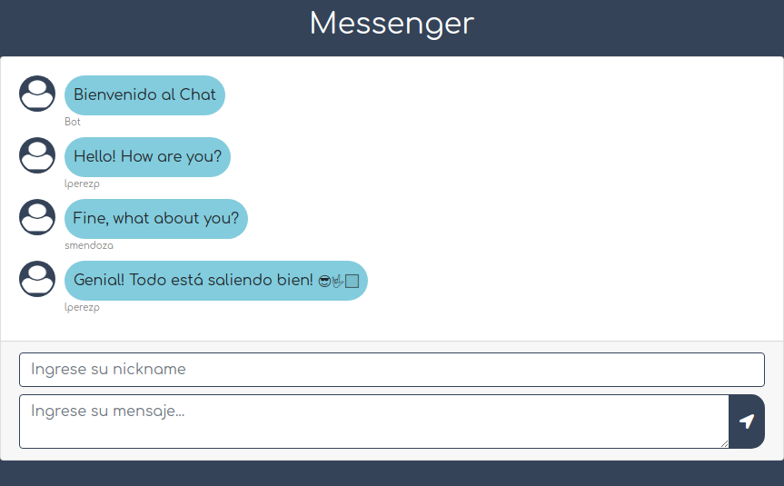

# Chat Realtime with NodeJS and SocketIO

Chat project using Node and SocketIO

## Tools

- [Node](https://nodejs.org/es/) v. 10.15.3
- [SocketIO](https://socket.io/) v. 2.3.0
- [Express](https://expressjs.com/es/) v. 4.17.1
- [Bootstrap](https://getbootstrap.com/) v. 4.4.1

### DevTools

- [Nodemon](https://nodemon.io/) v.2.0.1

## Development server

Run `npm start` for a dev server. Navigate to `http://localhost:2019/`. The app will automatically reload if you change any of the source files.

